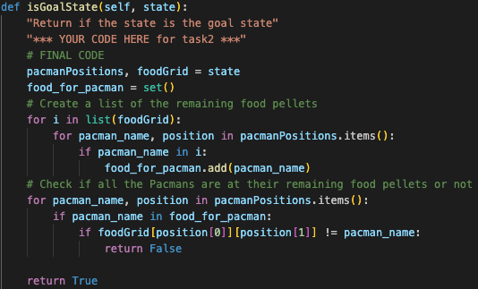
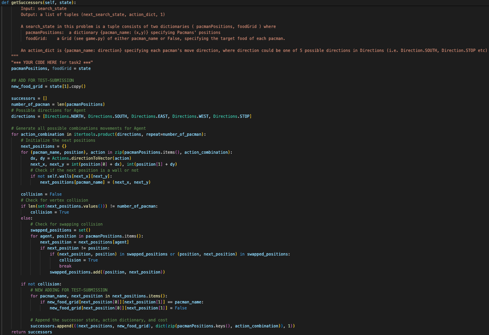

# Student Information

**Course:** COMP90054 AI Planning for Autonomy

**Semester:** Semester 1, 2024

**Student:** 

Patipan Rochanapon - 1117537 - prochanapon

**GITHUB**

https://github.com/COMP90054-2024s1/a1-prochanapon.git

**Collaborated With:**

> [!IMPORTANT]
> If you worked with another student, please include their **full name** and ask them to provide you with the **url to
their github codebase**. Their codebase should be private, you will not have access to the code, so there's no issue
> with knowing their URL, e.g. Collaborated with: Lionel Messi - URL: github.com/happy-with-the-worldcup-until-the-next-one.

# Self Evaluation

> [!NOTE]
> Do not exceed 500 words for each Part. This is indicative, no need to have 500 words, and it's not a strict limit.

## Part 1

#### Self Evaluated Marks (2 marks):

2

#### Code Performance

Given the implemented A* algorithm, the task is to create a heuristic function that possesses safe, goal aware,  admissibility and consistency properties, ensuring that the A* algorithm is guaranteed to find an optimal solution. 

In the first version, only the distance between Pacman and the closest food pallet is considered, which might result in a large number of expanded nodes if the food pellets are scattered widely. 

The second version try to overcome the flaws of first version by computing the sum of distance of Pacman position with all the remaining food pallets which cause less expanded nodes. However, it still doesn't consider the distribution of food pellets and treats all pellets equally.

The third version is also an improved version of the first one. However, this time it multiplies the minimum distance by the number of remaining food pellets, providing a more accurate estimate than the previous version and resulting in fewer expanded nodes.

The final version improves upon all the previous versions by considering both the minimum distance to the nearest food pellet and the total distance between all remaining food pellets. By doing this, it ensures that Pacman can move towards nearby pellets efficiently by incorporating the total distance between all remaining food pellets. Additionally, it provides a more informed estimate of the remaining cost to reach the goal state, guiding the search towards promising areas of the search space while avoiding unnecessary exploration of suboptimal paths which result in a small number of expanded nodes.

This image is the code initialization provided for all versions of this part.

This table contains all version of my code and the code perfomance.

#### Learning and Challenges

Initially, the decision on the heuristic was based on simplicity, with the first version considering only the distance to the nearest food pellet, which proved inefficient. Subsequent versions addressed this by factoring in total distance between all remaining food pellets and the count of remaining food pellets. Adjustments were made systematically, informed by testing and analysis, particularly focusing on food pellet distribution. The high number of expanded nodes and running time in the first version indicated suboptimal performance. To enhance simpler heuristics, we narrowed down the problem domain, focusing on relevant factors like Pacman's surroundings and food pellet distribution. One exciting discovery was the significant improvement achieved in the final version of the heuristic function, which resulted in a remarkably small number of expanded nodes and small running time.

#### Ideas That Almost Worked Well
All the previous versions that I tested.

#### Justification
I would like to give myself a full score for Part 1 because throughout my learning journey, I have been able to create a heuristic function that consistently yields a small number of expanded nodes and achieves fast running times for this specific problem, building upon insights gained from previous versions of the heuristic function.

#### New Tests Shared @ ED
> [!TIP]
> Tell us about your testcases and why were they useful

## Part 2

#### Self Evaluated Marks (2 marks):

1.5

#### Code Performance
Accurately identifying the goal state is crucial for ensuring the efficiency of the search algorithm. It ensures that the algorithm terminates in a timely manner and avoids unnecessary exploration. Similarly, generating successors efficiently is vital for improving the search algorithm's performance. Careful attention should be paid to how successors are generated to avoid errors such as vertex and swapping collisions, as well as moving to positions occupied by walls.

The way I recognise the goal state by ensuring that each Pacman is positioned at their respective remaining food pellets. To accomplish this, I create a set to track which food pellets belong to each Pacman. Then, I check if each Pacman is at their own food pellet by comparing their positions with the remaining food grid or not.

Here is the isGoalState function.

Here is my final online result that submitted with submission tag

Here is my final local result including hidden test that submitted with submission tag

As the problem scales up, the size of the state space increases exponentially due to the growing number of Pacman agents and the grid size. While algorithms like A* and Breadth-First Search can find the optimal solution, their running time may become prohibitively high.

#### Learning and Challenges
> [!TIP]
> Please include your top lessons learnt, and challenges faced.

#### Ideas That Almost Worked Well

Due to my shortsightedness, I forgot to update the new foodGrid when Pacman has eaten their own food pellets. As a result, it caused the result in a wrong state transition. 

Here is my final getSuccessors function with submission tag.

However, after fixing the new foodGrid part, the algorithm still can not find the correct solution. Even though it passes all the local tests, including hidden ones.

Here is my final getSuccessors function with test-submission tag.

After copying the getSuccessors function from the solution and submitting it for test-submission, I concluded that the issue lies within my getSuccessors function. This determination stemmed from the passing of all online tests for part 2. Additionally, I thoroughly checked the vertex and swapping collision algorithms, both of which appeared to be correct. Therefore, I believe that the problem may stem from the way I construct the successor states, which could differ from the approach used in the solution.

#### New Tests Shared @ ED
> [!TIP]
> Tell us about your testcases and why were they useful

#### Justification

I would give myself a score of 1.5 for part 2 because although I encountered challenges in identifying the issue with the getSuccessors function, I thoroughly examined the vertex and swapping collision algorithms, which appeared to be correct. Additionally, I made efforts to compare my implementation with the solution and concluded that the problem may lie in the way I construct the successor states. Despite not yet identifying the exact issue, I demonstrated diligence in troubleshooting and analyzing potential causes for the discrepancy.

## Part 3

#### Self Evaluated Marks (3 marks):

1

#### Code Performance

The implemented Conflict-Based Search (CBS) algorithm is designed to efficiently find conflict-free paths for multiple Pacman agents in the grid. Despite optimization efforts, it fails to produce an optimal solution, yielding a cost of 17 instead of the optimal 16. Upon analysis, it was discovered that the algorithm halts expansion of successors upon encountering constraints, opting to explore alternative paths instead. This behavior may compromise the algorithm's ability to reach an optimal solution.

Here is my final local result with submission tag.

Here is the image of the node stop exploring when facing constraint.

Upon encountering this issue, assuming that my algorithm from part 2 is correct locally, I investigated why Pacman B did not choose to stop and explore further. It became apparent that the problem stemmed from the construction of the Conflict-Based Search (CBS) algorithm. While node expansion appeared to yield the correct path, the algorithm halted prematurely, indicating a flaw in its design that likely prevents it from fully exploring potential solutions. Additionally, I suspect there might be an issue related to how the "stop" action is handled within the algorithm, potentially leading to premature termination of path exploration. This problem may also be exacerbated by the heuristic function.

In part 3, the complexity is primarily driven by the coordination and resolution of conflicts among multiple Pacman agents. While part 2 focuses on avoiding collisions and finding successor states for individual agents, part 3 introduces the challenge of constrainting the movements of multiple agents simultaneously to prevent conflicts and optimize overall paths. This coordination adds significant complexity, as it requires careful consideration of each agent's actions and potential interactions with others. Additionally, creating new A* algorithm that considers constraints further complicates the problem which only a part of CBS algorithm, requiring precise implementation to ensure both correctness and efficiency. Therefore, while part 3 shares some aspects of complexity with part 2, such as pathfinding and state space exploration, the added dimension of multi-agent coordination and conflict resolution makes it substantially more challenging.

#### Learning and Challenges

Constructing the CBS algorithm involves creating multiple functions, each playing a crucial role in its operation. One particularly intricate aspect is the implementation of a new A* function that considers constraints, adding complexity to the algorithm. This functionality requires careful design and integration to ensure efficient conflict resolution and optimal pathfinding. Moreover the choice of heurictic function need to be explored more because the reason that the node stop expandsion might be related to the heuristic value.

One of the key takeaways from this part is the realization that while understanding how an algorithm works conceptually is important, implementing it in code can be challenging. It emphasizes the significance of careful planning and step-by-step debugging to identify and address issues effectively. This experience underscores the importance of practical coding skills and iterative problem-solving methods to navigate complex algorithms successfully.

#### Ideas That Almost Worked Well

#### Justification

I would rate myself 1 for part 3. Despite facing challenges in understanding and implementing the Conflict-Based Search algorithm, I made efforts to identify issues and explore solutions. Although the algorithm didn't achieve optimal results, I demonstrated a willingness to analyze and debug the code for improvement. This experience provided valuable insights into multi-agent pathfinding complexities, guiding future problem-solving endeavors.

#### New Tests Shared @ ED

## Meta-Cognition

Throughout this assignment, my understanding of heuristic search, heuristic design, and state space modeling has deepened. Initially, I favored simplistic heuristics but learned to incorporate more informed estimates, realizing their impact on search algorithm efficiency (Expanded Node). As I progressed, I recognized the importance of considering additional factors in heuristic design, leading to a better understanding of how different heuristics affect algorithm performance. Moreover, tackling complex problems like multi-agent pathfinding and conflict resolution in later parts enhanced my appreciation for thoughtful heuristic design and state space modeling. Overall, this assignment has equipped me with valuable skills for addressing intricate AI planning tasks more effectively.
